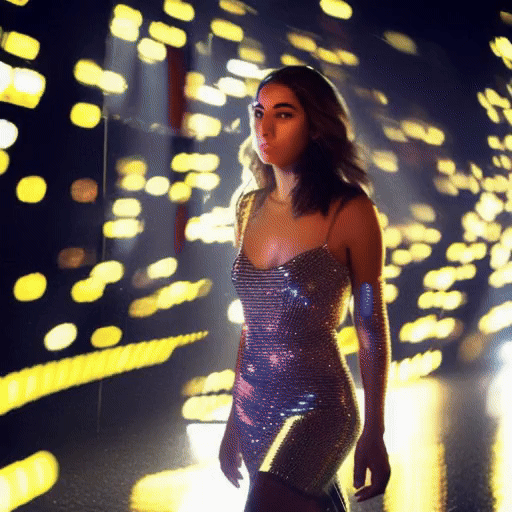

# UniCtrl

[](https://arxiv.org/abs/2403.02332)
[](https://unified-attention-control.github.io/)
[](https://huggingface.co/spaces/Xuweiyi/UniCtrl)


This repository is the implementation of

### [TMLR 2024] UniCtrl: Improving the Spatiotemporal Consistency of Text-to-Video Diffusion Models via Training-Free Unified Attention Control

- **Authors**: [Tian Xia](https://tianx-ia.github.io/)<sup>\*</sup>, [Xuweiyi Chen](https://xuweiyichen.github.io/)<sup>\*</sup>, [Sihan Xu](https://sihanxu.github.io/)<sup>**</sup>
- **Affiliation**: University of Michigan, University of Virginia, PixAI.art, 
- <sup>*</sup>*Equal contribution*, <sup>**</sup>*Correspondence*

### [Project page](https://unified-attention-control.github.io/) | [Paper](https://arxiv.org/abs/2403.02332) | Demo
<table>
  <tr>
    <td></td>
    <td></td>
  </tr>
  <tr>
    <td align="center">Original</td>
    <td align="center">UniCtrl</td>
  </tr>
</table>

<table>
  <tr>
    <td></td>
    <td></td>
  </tr>
  <tr>
    <td align="center">Original</td>
    <td align="center">UniCtrl</td>
  </tr>
</table>

## Updates🔥 

- Our code about UniCtrl is released and you can checkout our [paper](https://arxiv.org/abs/2403.02332) as well!

## Overview 📖


We introduce UniCtrl, a novel, plug-and-play method that is universally applicable to improve the spatiotemporal consistency and motion diversity of videos generated by text-to-video models without additional training. UniCtrl ensures semantic consistency across different frames through cross-frame self-attention control, and meanwhile, enhances the motion quality and spatiotemporal consistency through motion injection and spatiotemporal synchronization.

## Quick Start🔨

### 1. Clone Repo

```
git clone https://github.com/XuweiyiChen/UniCtrl.git
cd UniCtrl
cd examples/AnimateDiff
```

### 2. Prepare Environment

```
conda env create -f environment.yaml
conda activate animatediff_pt2
```

### 3. Download Checkpoints

Please refer to the [official repo](https://github.com/guoyww/AnimateDiff) of AnimateDiff for the full setup guide. The setup guide is listed [here](https://github.com/guoyww/AnimateDiff/blob/main/__assets__/docs/animatediff.md).

Quickstart guide
```
git lfs install
git clone https://huggingface.co/runwayml/stable-diffusion-v1-5 models/StableDiffusion/

bash download_bashscripts/0-MotionModule.sh
bash download_bashscripts/5-RealisticVision.sh
```

### 🤗 Gradio Demo

We provide a Gradio Demo to demonstrate our method with UI.

```
python app.py
```
Alternatively, you can try the online demo hosted on Hugging Face: [[demo link]](https://huggingface.co/).

## Citation :fountain_pen: 

   If you find our repo useful for your research, please consider citing our paper:

   ```bibtex
    @misc{chen2024unictrl,
        title={UniCtrl: Improving the Spatiotemporal Consistency of Text-to-Video Diffusion Models via Training-Free Unified Attention Control}, 
        author={Xuweiyi Chen and Tian Xia and Sihan Xu},
        year={2024},
        eprint={2403.02332},
        archivePrefix={arXiv},
        primaryClass={cs.CV}
    }
   ```

## Acknowledgement :white_heart:

This project is distributed under the MIT License. See `LICENSE` for more information.

The example code is built upon [AnimateDiff](https://github.com/guoyww/AnimateDiff) and [FreeInit](https://github.com/TianxingWu/FreeInit). Thanks to the team for their impressive work!

